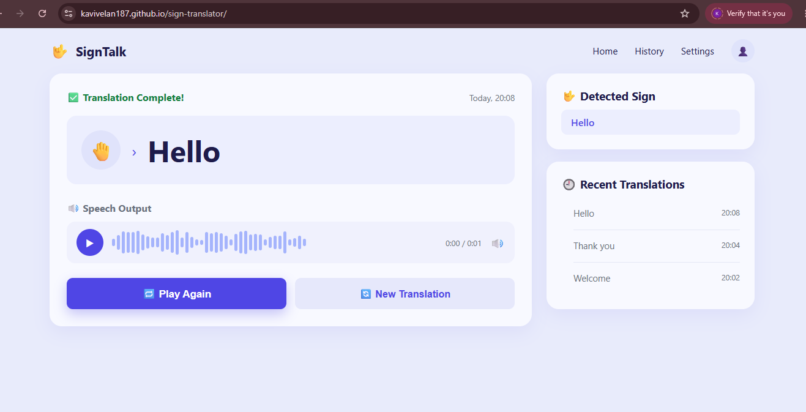

# Sign Translator

**Live Demo:** https://kavivelan187.github.io/sign-translator/



A browser-based sign language to text and speech translator. It uses your webcam to detect hand landmarks in real time, matches the gesture against recorded samples, and shows the recognized word as text and speaks it aloud.

> Status: work in progress (mini project, AI & Data Science).

## Problem Statement

Communication between sign language users and people who don't know sign language is difficult. This project aims to bridge that gap with a simple, no-install web tool that runs entirely in the browser.

## Approach

1. **Hand detection**: The webcam feed is processed with a hand-tracking model (MediaPipe Hands) that returns 21 landmark points (x, y, z) per hand.
2. **Data collection**: `record.html` lets us record landmark samples for each gesture/label.
3. **Dataset creation**: `make_data_file.html` converts the recorded samples into `gestures_data.js`, the gesture dataset used by the recognizer.
4. **Preprocessing**: Landmarks are normalized so recognition does not depend on hand position or distance from the camera.
5. **Recognition**: `recognizer.js` compares live landmarks with the stored gesture samples and picks the closest match.
6. **Output**: The predicted label is displayed as text and spoken using the browser's Text-to-Speech (Web Speech API).

```
Webcam -> Hand landmarks -> Normalize -> Match with gesture data -> Text + Speech
```

## Project Structure

| File | Purpose |
|------|---------|
| `index.html` | Main app: live translation (text + speech) |
| `record.html` | Record gesture samples from the webcam |
| `make_data_file.html` | Build the gesture dataset file from recordings |
| `hands.js` | Hand landmark detection |
| `recognizer.js` | Gesture matching / recognition logic |
| `gestures_data.js` | Stored gesture dataset |
| `script.js`, `style.css` | App logic and styling |
| `hero.png`, `demo.png` | Images |

## How to Run

1. Clone the repo:
```
   git clone https://github.com/kavithakrishnamoorthi187vellan/sign-translator.git
   cd sign-translator
```
2. Start a local server (the webcam needs `localhost` or HTTPS):
```
   python -m http.server 8000
```
3. Open `http://localhost:8000` in Chrome and allow camera access.

Or just open the live demo link above.

### Adding your own gestures

1. Open `record.html` and record samples for a gesture.
2. Open `make_data_file.html` to generate the updated data file.
3. Replace `gestures_data.js` with the generated file and reload `index.html`.

## Tech Stack

- HTML, CSS, JavaScript
- MediaPipe Hands (landmark detection)
- Web Speech API (text-to-speech)

## Current Limitations

- Supports only the gestures recorded in `gestures_data.js`
- Accuracy depends on lighting and camera quality
- Single-hand, word/letter level recognition (no full sentences yet)

## Future Work

- Add more signs and a larger dataset
- Train a proper ML model for better accuracy
- Support two-hand and motion-based signs
- Sentence formation and multi-language speech

## Authors

- Kavitha. K
- Angel. S

B.Tech Artificial Intelligence and Data Science, 2nd year.
Developed for the project expo.
